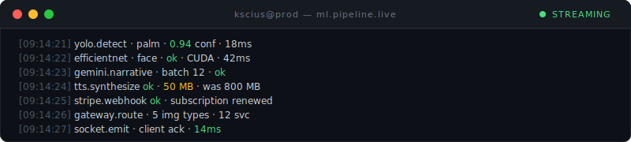

# Mitzael Serna

### Senior Full-Stack ML Engineer & Tech Lead

14 years architecting and shipping scalable systems — web apps, microservices, AI platforms, and backend infrastructure across Python, Ruby, Elixir, TypeScript, C#, and whatever else the problem demands. Rails, FastAPI, PyTorch, React, Vue, .NET, Node.js — different industries, same goal: build things that hold up in production.

Focused lately on production AI: computer vision pipelines, LLM integration, and distributed microservices. I lead cross-functional teams, design systems at scale (**1M+ req/mo**), and pick up new stacks fast. ML infrastructure, AI-assisted workflows, and modern DevOps are how I ship.

  

  

  

---

**→ [kscius.github.io](https://kscius.github.io)** · CV & portfolio · 14+ years · 1M+ req/mo · 12+ ML services · built with [Cursor](https://cursor.com/referral?code=1H9HB4ATI39J)

     
